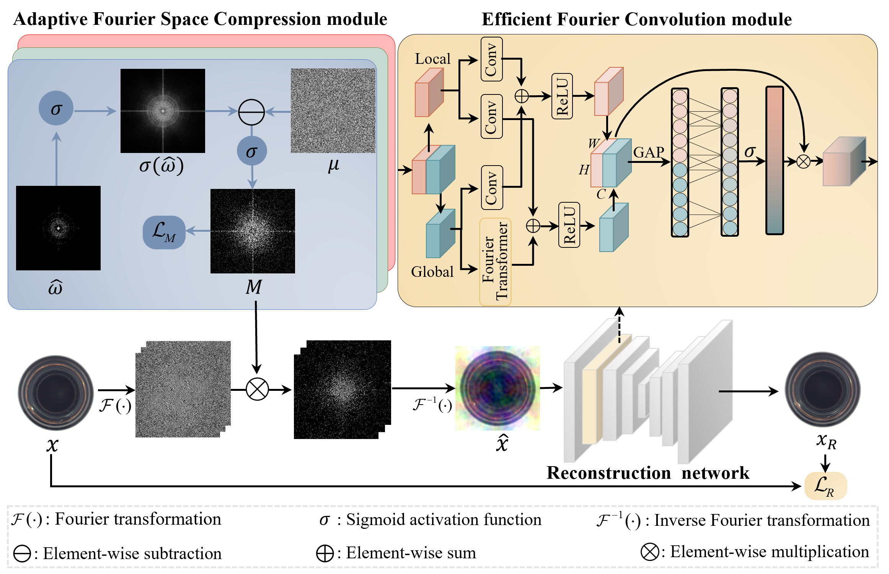

# AFSC
The code implementation of the AFSC.
Download the model checkpoints of Mvtec AD and extract the zip so that the checkpoints folder will be located in the base directory of this repository.
Download link:
[https://mega.nz/file/kNoTgLhI#nNq8aP1r5QC_5ub4wfoq5yUPtCl2bKFCgiq4gKalZtY](https://mega.nz/file/kNoTgLhI#nNq8aP1r5QC_5ub4wfoq5yUPtCl2bKFCgiq4gKalZtY)

